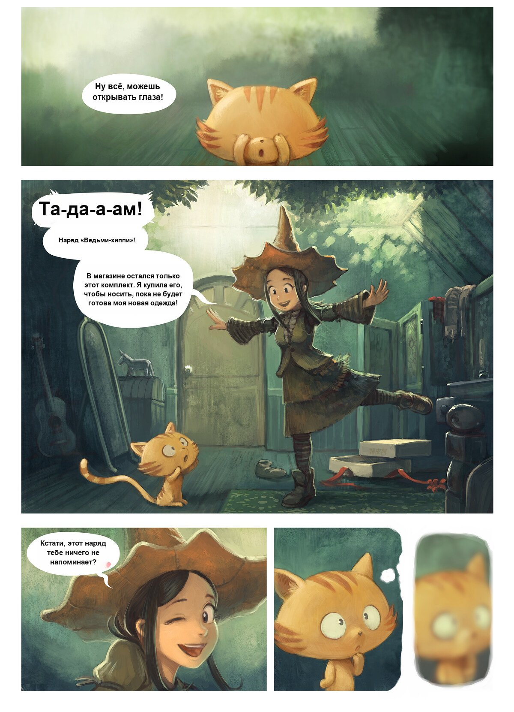

# Kotoba

[](LICENSE)
[](https://www.python.org/downloads/)

**A manga translator that remembers characters across pages.**

Most automatic manga translators handle each speech bubble in isolation, so they re-translate the same character with a different name, get the wrong grammatical gender, or miss tone shifts. Kotoba builds up a **character archive** as it processes a chapter — recording each speaker's appearance, gender, and behavior — then uses that context plus per-page scene analysis to translate bubbles more consistently.

Everything runs **locally** on your machine via [Ollama](https://ollama.com). No cloud API keys.

## Example

<table>
<tr>
<th width="50%">Original (Chinese)</th>
<th width="50%">Kotoba → Russian</th>
</tr>
<tr>
<td></td>
<td></td>
</tr>
</table>

<sub>Sample artwork: *Pepper&Carrot* by [David Revoy](https://www.peppercarrot.com/), licensed under [CC-BY 4.0](https://creativecommons.org/licenses/by/4.0/). Chinese localization by the Pepper&Carrot community.</sub>

## What makes it different

| | Kotoba | Most other tools |
|---|---|---|
| Tracks characters across pages | ✅ | ❌ |
| Scene-aware translation (knows what's happening on the page) | ✅ | ❌ |
| Speaker attribution (who said this?) | ✅ | Rarely |
| Per-bubble font/size override in the editor | ✅ | Sometimes |
| Portable Python — no system install needed | ✅ (Windows) | Usually a `pip install` chore |
| Fully local, no cloud APIs | ✅ | Mixed |
| Web UI with drag-and-drop + editor + i18n | ✅ EN/RU | Some |

## Pipeline

```
Page image
  │
  ├─► Bubble detection         (RT-DETRv2)
  ├─► OCR per bubble           (glm-ocr via Ollama)
  ├─► Page analysis            (vision LLM — characters + scene)
  ├─► Speaker attribution      (vision LLM — who said what)
  ├─► Batch translation        (text LLM — uses speaker, gender, scene)
  ├─► Original text removal    (anime-big-lama inpainting)
  └─► Translated text render   (PIL — auto font size, smart wrapping)
```

A **Fast mode** toggle skips the page-analysis and attribution stages — useful for quick drafts when context isn't critical (saves ~30-60 seconds per page).

## Requirements

- **Windows 10/11, Linux, or macOS** (Apple Silicon supported)
- **Ollama** — install from https://ollama.com and pull a few models:
  ```
  ollama pull gemma3:27b   # or any vision-capable model: llava, gemma4, qwen2.5-vl, etc.
  ollama pull glm-ocr      # OCR model
  ```
- **~6 GB free disk space** for the portable Python environment
- **GPU recommended** — works on CPU but each page takes much longer. NVIDIA cards use CUDA automatically.

## Quick start (Windows — fully portable)

1. Download or clone the repo into any folder (paths with spaces are fine).
2. Double-click **`run.bat`**.
3. On first launch the script downloads a portable Python interpreter (~10 MB) plus all dependencies (~3 GB if CUDA torch is enabled) into a `python_embed/` subfolder. Your system Python is not touched.
4. Your browser opens to http://localhost:8000 automatically.
5. Drag a chapter (or a single page) onto the page and click translate.

Subsequent launches are instant.

## Quick start (Linux / macOS)

```bash
chmod +x run.sh
./run.sh
```

Downloads a [python-build-standalone](https://github.com/indygreg/python-build-standalone) distribution into `python_embed/` on first run.

## Manual install

If you'd rather use your system Python:

```bash
python3.11 -m venv venv
source venv/bin/activate   # or venv\Scripts\activate on Windows
pip install -r requirements.txt
python setup.py
```

For CUDA, make sure the `--extra-index-url` line in `requirements.txt` matches your CUDA version (default: cu124).

## Usage

Once the web UI is open:

1. **Translate** tab — drag and drop one or more page images, or a folder. Configure:
   - **Target language** — Russian, English, etc.
   - **LLM model** — vision-capable Ollama model (recommended: `gemma3:27b` or `gemma4:26b`; avoid abliterated builds — they often have broken vision/template tags)
   - **Font** — optional path to a manga font (`Anime Ace`, `CC Wild Words`, etc.); Kotoba auto-picks the best bold font installed on your system
   - **Fast mode** — skip page analysis for quick drafts
   - **Debug boxes** — overlay coloured rectangles showing OCR/translation status per bubble
2. **Editor** tab — fix any bubble's translation, override font or size for a specific bubble, re-render the page.
3. **Characters** tab — view and edit the auto-built character archive (`characters.json`).

## Configuration

User preferences (language, model, font, debug toggles) are stored in your browser's **localStorage**. Job data (uploaded pages, translations, per-bubble overrides) live in **`web_data/`** next to the project.

The character archive is **`characters.json`** in the project root. You can edit or delete it freely. Deleting it starts a fresh archive.

LLM weights cache to `~/.cache/huggingface/hub/` (anime-big-lama, RT-DETRv2) — Ollama models live wherever you configured Ollama to store them.

## Privacy

Kotoba never sends your images, text, or anything else off your machine. The only network requests are:

- **First launch:** downloads of the portable Python, dependencies, and model weights (LaMa, RT-DETRv2) from python.org, PyPI, and HuggingFace.
- **Each translation:** local HTTP to `localhost:11434` (Ollama).

You can air-gap the machine after the initial setup and it will still work.

## How character memory works

Each page's vision-LLM call gets the **archive of every character seen so far** as part of the prompt. For each new visible character the model decides: "is this someone I've seen before?" If yes, it reuses the existing ID; if no, it adds a new entry with a description.

The next page sees the updated archive. Over a chapter this becomes detailed enough that:

- Recurring characters get **consistent names** even when their appearance changes (hair style, clothes)
- Translations use the **right grammatical gender** (critical for Russian and other gendered languages)
- The model knows **who is speaking** without re-analyzing the whole page

Same applies to scene context: a short summary of each page accumulates over the chapter, so dialogue on page 15 can reference "the bald hero seen earlier in the alley".

## Known limitations

- **Sound effects outside speech bubbles** (the big hand-drawn ガッ, ZUDODO, etc. drawn on the artwork) aren't currently detected. The bubble detector only finds proper speech bubbles. A proper SFX detector would need a trained text-detection model, which Kotoba doesn't ship.
- **Abliterated Ollama models** (`huihui_ai/gemma-4-abliterated`, etc.) often have broken vision or template tags and return empty responses unpredictably. Use the regular `gemma3:27b` or `gemma4:26b` instead.
- **Very stylized fonts in the original page** can confuse OCR. Re-OCR with a smaller crop often helps; the editor lets you fix any bubble manually.
- **Vertical Japanese text** is supported by glm-ocr but quality varies. For tategaki-heavy pages you may need to edit individual bubbles.

## Contributing

Issues and PRs welcome. Please describe your platform (OS, GPU) and include a server log when reporting bugs — most issues turn out to be either Ollama model quirks or font/path issues.

## License

MIT — see [LICENSE](LICENSE).

## Credits

Kotoba stands on the shoulders of several excellent open-source projects:

- [RT-DETRv2](https://github.com/lyuwenyu/RT-DETR) — bubble detection
- [ogkalu2/comic-text-and-bubble-detector](https://huggingface.co/ogkalu/comic-text-and-bubble-detector) — finetuned RT-DETRv2 weights for comic panels
- [anime-big-lama](https://huggingface.co/df1412/anime-big-lama) — manga-finetuned LaMa inpainting
- [glm-ocr](https://ollama.com/) and [Gemma](https://ai.google.dev/gemma) for OCR/translation via Ollama
- [Ollama](https://ollama.com) — local model serving
- [transformers](https://github.com/huggingface/transformers) and [PyTorch](https://pytorch.org) for inference

### Sample artwork

The example page in this README is from the webcomic ***Pepper&Carrot*** by [**David Revoy**](https://www.peppercarrot.com/), used under the [Creative Commons Attribution 4.0 International License (CC-BY 4.0)](https://creativecommons.org/licenses/by/4.0/). The Chinese localization shown is by the Pepper&Carrot community.

Pepper&Carrot is a free-libre webcomic — please support its author at https://www.peppercarrot.com/.

