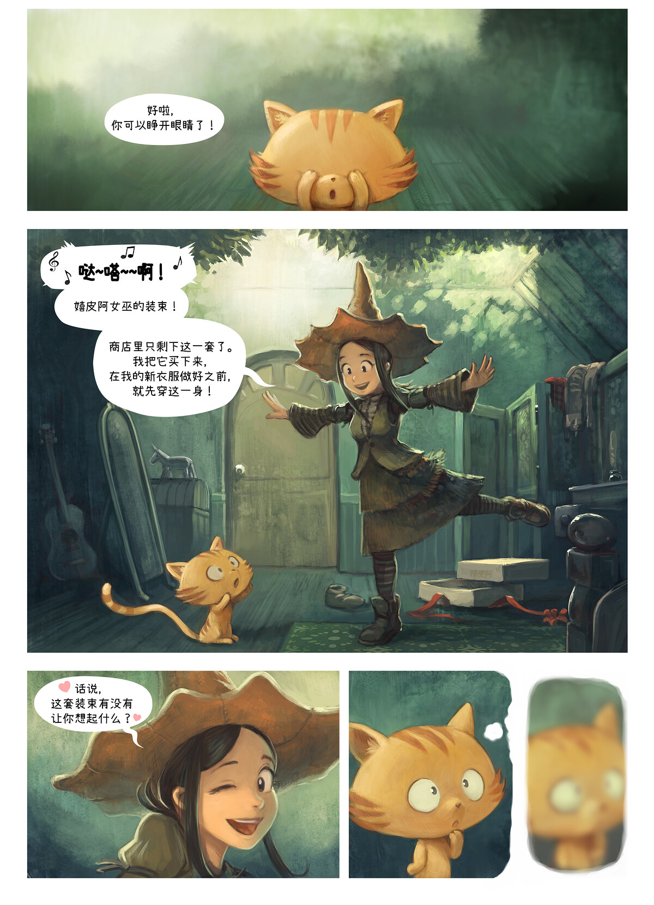
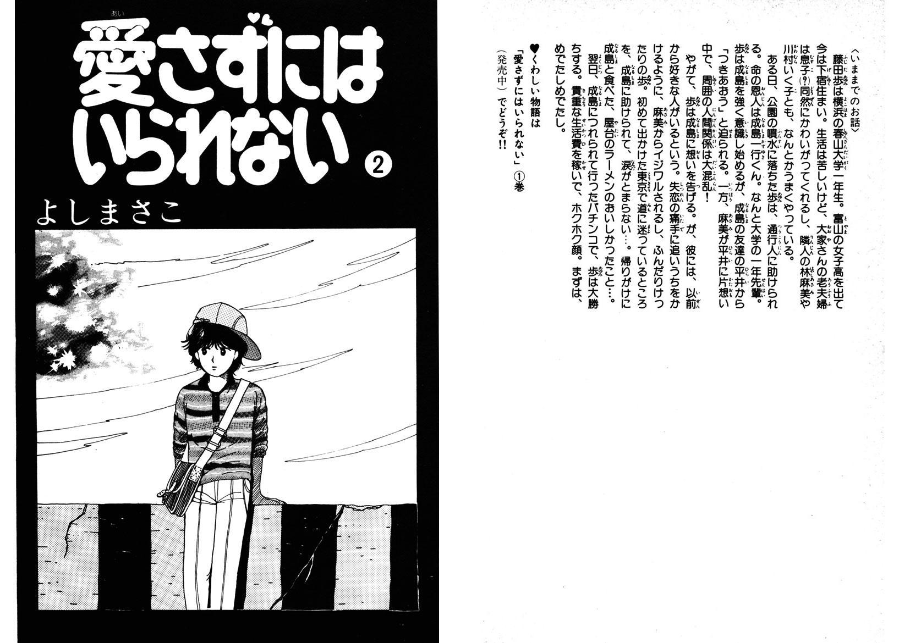
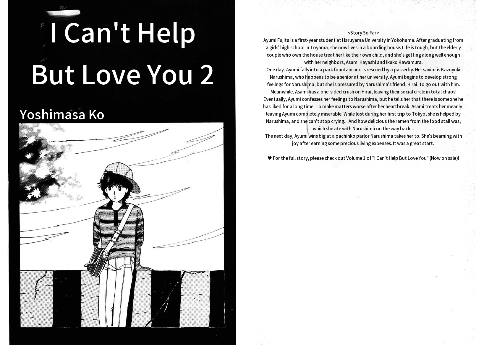
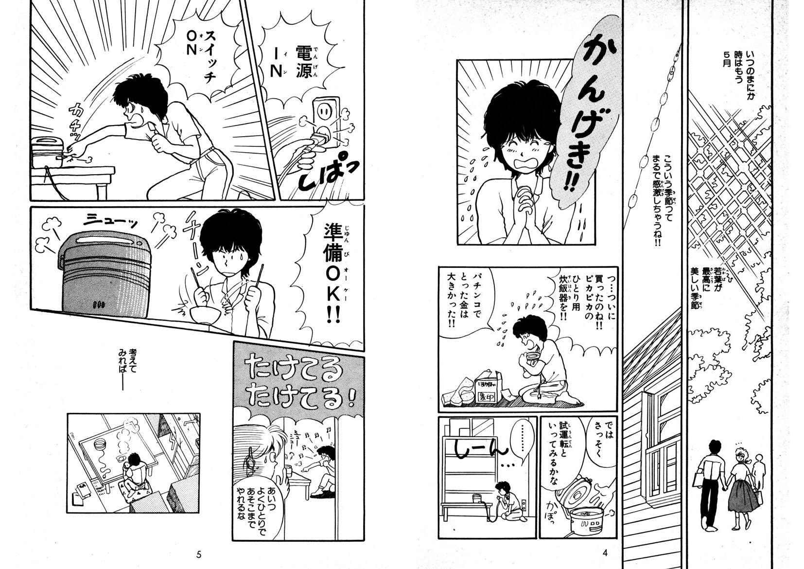
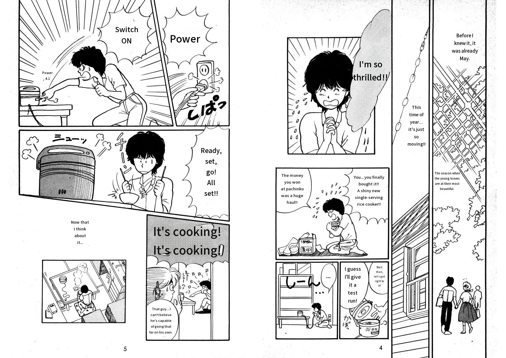

# Kotoba

[](LICENSE)
[](https://www.python.org/downloads/)

**A manga translator that remembers characters across pages.**

Most automatic manga translators handle each speech bubble in isolation, so they re-translate the same character with a different name, get the wrong grammatical gender, or miss tone shifts. Kotoba builds up a **character archive** as it processes a chapter — recording each speaker's appearance and gender — then uses dialogue links and neighboring source text to translate bubbles more consistently.

Everything runs **locally** on your machine via [Ollama](https://ollama.com). No cloud API keys.

## Examples

**Pepper&Carrot** — Chinese → English

<table>
<tr>
<th width="50%">Original (Chinese)</th>
<th width="50%">Kotoba → English</th>
</tr>
<tr>
<td></td>
<td></td>
</tr>
</table>

<sub>*Pepper&Carrot* by [David Revoy](https://www.peppercarrot.com/), [CC-BY 4.0](https://creativecommons.org/licenses/by/4.0/). Chinese localization by the Pepper&Carrot community.</sub>

---

**愛さずにはいられない (I Can't Help But Love You)** — Japanese → English

<table>
<tr>
<th width="50%">Original (Japanese)</th>
<th width="50%">Kotoba → English</th>
</tr>
<tr>
<td></td>
<td></td>
</tr>
<tr>
<td></td>
<td></td>
</tr>
</table>

<sub>*愛さずにはいられない* by よしまさこ. From the [Manga109](http://www.manga109.org/) dataset, used under the Manga109 research license for non-commercial purposes. © よしまさこ / 集英社.</sub>

## Pipeline

```
All pages: bubble detection (RT-DETRv2) → OCR (Hayai OCR v2.5 Nova)
All pages: page analysis → speaker attribution → translation (Ollama vision model)
All pages: text masks → inpainting (anime-big-lama) → translated text rendering
```

The local detection and OCR models finish their pass before the selected Ollama model is loaded for the chapter. The Ollama model is unloaded before GPU inpainting starts. This avoids switching large models between pages. **Fast mode** skips page analysis and speaker attribution for a quicker draft; translation then has less context.

## Code structure

The pipeline is coordinated by `manga_translator.py`. Model loading, OCR, page analysis,
translation, rendering, image conversion, settings and persistence live in separate Python
modules. `web.py` exposes the API; `ollama_models.py` checks model capabilities;
`web_ui.html` and `static/` contain the frontend.

See [architecture and model data contracts](docs/ARCHITECTURE.md) for the module map,
canonical bubble format and compatibility with saved jobs.

Command-line translation:

```sh
python manga_translator.py input --output-dir results --llm-model YOUR_MODEL --target-lang Russian
```

## Requirements

- **Windows 10/11, Linux, or macOS** (Apple Silicon supported)
- **Ollama** — install from https://ollama.com and pull a vision-capable model:
  ```
  ollama pull qwen3.8:27b   # or another model with vision support
  ```
  The web UI checks Ollama's reported model capabilities when listing installed models. Hayai OCR and its SigLIP2 image processor download from Hugging Face when first needed; no Ollama OCR model is needed.
- **Disk space** for the portable Python environment, Hugging Face weights and your chosen Ollama model; large vision models can require tens of gigabytes
- **GPU recommended** — works on CPU but each page takes much longer. NVIDIA cards use CUDA automatically.

## Quick start (Windows — fully portable)

1. Download or clone the repo into any folder (paths with spaces are fine).
2. Install [Ollama](https://ollama.com), start it, and pull a vision-capable model as shown above.
3. Double-click **`run.bat`**.
4. On first launch the script downloads a portable Python interpreter (~10 MB) plus dependencies into a `python_embed/` subfolder. Your system Python is not touched.
5. Your browser opens to http://localhost:8000 automatically.
6. Select page images or a ZIP/CBZ chapter archive, choose a model, and start translating.

Subsequent launches are instant.

## Quick start (Linux / macOS)

```bash
chmod +x run.sh
./run.sh
```

Downloads a [python-build-standalone](https://github.com/indygreg/python-build-standalone) distribution into `python_embed/` on first run.

## Manual install

If you'd rather use your system Python:

```bash
python3.11 -m venv venv
source venv/bin/activate   # or venv\Scripts\activate on Windows
pip install torch torchvision --index-url https://download.pytorch.org/whl/cu128
pip install -r requirements.txt
python setup.py
```

PyTorch is installed separately so you can pick the right build. `cu128` supports modern NVIDIA cards including RTX 50xx (Blackwell); for older CUDA use the matching index (e.g. `cu121`), or drop the `--index-url` line entirely for a CPU-only build.

## Usage

Once the web UI is open:

1. **Translate** tab — select or drop page images, or a ZIP/CBZ chapter archive. Configure:
   - **Target language** — Russian, English, etc.
   - **LLM model** — an installed Ollama model with vision support, such as `qwen3.8:27b` or `gemma4:31b`. The picker groups models using Ollama's reported capabilities.
   - **Font** — optional path to a manga font (`Anime Ace`, `CC Wild Words`, etc.); Kotoba auto-picks the best bold font installed on your system
   - **Fast mode** — skip page analysis for quick drafts
   - **Debug boxes** — enable them in Settings to overlay coloured rectangles showing OCR/translation status per bubble
2. **Editor** tab — fix any bubble's translation and restyle it per bubble: font, size, colour, outline, bold/italic/underline, alignment, or rotation; move and resize the text box; then re-render the page.
3. **Characters** tab — view and edit the auto-built character archive (`characters.json`).
4. **Glossary** — define fixed term translations (source → target, with an optional note) that are always applied, even when context would suggest otherwise. Handy for names, place names, and recurring jargon so they stay consistent across the whole chapter.
5. **Settings** — adjust detection, rendering, translation and diagnostic options.

## Configuration

User preferences (language, model, font, debug toggles) are stored in your browser's **localStorage**. Job data (uploaded pages, translations, per-bubble overrides) live in **`web_data/`** next to the project.

The character archive is **`characters.json`** in the project root. You can edit or delete it freely. Deleting it starts a fresh archive.

Model weights cache to `~/.cache/huggingface/hub/` (anime-big-lama, RT-DETRv2, Hayai OCR, comic-text-detector) — Ollama models live wherever you configured Ollama to store them.

## Privacy

Kotoba never sends your images, text, or anything else off your machine. The only network requests are:

- **Setup and first model use:** downloads of portable Python, dependencies, and model weights (LaMa, RT-DETRv2, Hayai OCR, comic-text-detector) from python.org, PyPI, and Hugging Face.
- **Each translation:** HTTP to the configured Ollama endpoint, local at `127.0.0.1:11434` by default.

After dependencies, model weights and the Ollama model have been downloaded, the default local setup can run offline.

## How character memory works

Each page's vision-LLM call gets the **archive of every character seen so far** as part of the prompt. For each new visible character the model decides: "is this someone I've seen before?" If yes, it reuses the existing ID; if no, it adds a new entry with a description.

The next page sees the updated archive. Over a chapter this becomes detailed enough that:

- Recurring characters get **consistent names** even when their appearance changes (hair style, clothes)
- Translations use the **right grammatical gender** (critical for Russian and other gendered languages)
- The model knows **who is speaking** without re-analyzing the whole page

Each translation batch sees nearby dialogue from the current page, even when it falls outside that batch. Page analysis supplies only clear links between utterances, avoiding speculative scene summaries.

## Known limitations

- **Sound effects outside speech bubbles** use the detector's `text_free` class and a separate confidence threshold. Highly stylized lettering can still be missed or recognized incorrectly.
- **Abliterated Ollama models** (`huihui_ai/gemma-4-abliterated`, etc.) often have broken vision or template tags and return empty responses unpredictably. Use the regular `gemma3:27b` or `gemma4:26b` instead.
- **Very stylized fonts in the original page** can confuse OCR. Re-OCR with a smaller crop often helps; the editor lets you fix any bubble manually.
- **Vertical Japanese text** is supported by Hayai OCR, though illustrated or overlapping regions may still need manual correction.

## Contributing

Issues and PRs welcome. Please describe your platform (OS, GPU) and include a server log when reporting bugs — most issues turn out to be either Ollama model quirks or font/path issues.

## License

MIT — see [LICENSE](LICENSE).

## Credits

Kotoba stands on the shoulders of several excellent open-source projects:

- [RT-DETRv2](https://github.com/lyuwenyu/RT-DETR) — bubble detection
- [ogkalu2/comic-text-and-bubble-detector](https://huggingface.co/ogkalu/comic-text-and-bubble-detector) — finetuned RT-DETRv2 weights for comic panels
- [anime-big-lama](https://huggingface.co/df1412/anime-big-lama) — manga-finetuned LaMa inpainting
- [comic-text-detector](https://huggingface.co/mayocream/comic-text-detector-onnx) — pixel-level text segmentation for masks
- [Hayai OCR v2.5 Nova](https://huggingface.co/JustANormalTinkerer/hayai-ocr-v2.5-nova) — OCR (via transformers, custom model code)
- [Gemma](https://ai.google.dev/gemma) and other vision LLMs — page analysis & translation (via Ollama)
- [Ollama](https://ollama.com) — local model serving
- [transformers](https://github.com/huggingface/transformers) and [PyTorch](https://pytorch.org) for inference

### Sample artwork

**Pepper&Carrot** — The first example is from the webcomic ***Pepper&Carrot*** by [**David Revoy**](https://www.peppercarrot.com/), used under the [Creative Commons Attribution 4.0 International License (CC-BY 4.0)](https://creativecommons.org/licenses/by/4.0/). The Chinese localization is by the Pepper&Carrot community. Pepper&Carrot is a free-libre webcomic — please support its author at https://www.peppercarrot.com/.

**愛さずにはいられない** — The second and third examples are pages from *愛さずにはいられない* (I Can't Help But Love You) by よしまさこ, © よしまさこ / 集英社. These pages are from the [Manga109](http://www.manga109.org/) dataset (`Manga109s_released_2023_12_07`) and are used here for non-commercial research and demonstration purposes only, under the [Manga109 research license](http://www.manga109.org/en/agreement.html).
